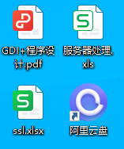

## 数据说明

王者荣耀KPL 【2022世冠】 赛事数据

## 数据来源

王者荣耀官网：

https://pvp.qq.com/match/kpl/kingproleague/index.html

## 字段说明

> 战队数据：

| 字段               | 类型   | 说明               |
|--------------------|--------|--------------------|
| 排名               | int    | 排名               |
| icon               | string | icon               |
| 战队               | string | 战队               |
| 比赛场次           | string | 比赛场次           |
| 胜场               | int    | 胜场               |
| 胜率               | string | 胜率               |
| 场均KDA            | string | 场均KDA            |
| 场均击杀数         | float  | 场均击杀数         |
| 场均死亡数         | float  | 场均死亡数         |
| 场均助攻数         | float  | 场均助攻数         |
| 场均经济           | float  | 场均经济           |
| 分均经济           | float  | 分均经济           |
| 场均伤害           | float  | 场均伤害           |
| 分均伤害           | float  | 分均伤害           |
| 场均承伤           | float  | 场均承伤           |
| 分均承伤           | float  | 分均承伤           |
| 一血率             | string | 一血率             |
| 场均推塔数         | float  | 场均推塔数         |
| 场均被推塔数       | float  | 场均被推塔数       |
| 场均暴君数据       | float  | 场均暴君数据       |
| 场均暴君控制率     | string | 场均暴君控制率     |
| 场均主宰数         | float  | 场均主宰数         |
| 场均主宰控制率     | string | 场均主宰控制率     |
| 场均风暴龙王数     | float  | 场均风暴龙王数     |
| 场均风暴龙王控制率 | string | 场均风暴龙王控制率 |
| 场均比赛时长       | string | 场均比赛时长       |

> 选手数据：

| 字段         | 类型   | 说明         |
|--------------|--------|--------------|
| 排名         | int    | 排名         |
| icon         | string | icon         |
| 选手         | string | 选手         |
| 比赛场次     | string | 比赛场次     |
| 胜场         | int    | 胜场         |
| 胜率         | string | 胜率         |
| 场均KDA      | string | 场均KDA      |
| 场均击杀数   | float  | 场均击杀数   |
| 场均死亡数   | float  | 场均死亡数   |
| 场均助攻数   | float  | 场均助攻数   |
| 场均经济     | float  | 场均经济     |
| 分均经济     | float  | 分均经济     |
| 经济占比     | string | 经济占比     |
| 场均伤害     | float  | 场均伤害     |
| 分均伤害     | float  | 分均伤害     |
| 伤害占比     | string | 伤害占比     |
| 伤害转化率   | string | 伤害转化率   |
| 场均承伤     | float  | 场均承伤     |
| 分均承伤     | float  | 分均承伤     |
| 承伤占比     | string | 承伤占比     |
| 场均推塔数   | float  | 场均推塔数   |
| 推塔占比     | string | 推塔占比     |
| 参团率       | string | 参团率       |
| 场均比赛时长 | string | 场均比赛时长 |

> 英雄数据：

| 字段         | 类型   | 说明         |
|--------------|--------|--------------|
| 排名         | int    | 排名         |
| icon         | string | icon         |
| 英雄         | string | 英雄         |
| 出场次数     | string | 出场次数     |
| 出场率       | int    | 出场率       |
| 被禁率       | string | 被禁率       |
| 胜场次数     | string | 胜场次数     |
| 胜率         | float  | 胜率         |
| 场均击杀数   | float  | 场均击杀数   |
| 场均死亡数   | float  | 场均死亡数   |
| 场均助攻数   | float  | 场均助攻数   |
| 场均比赛时长 | float  | 场均比赛时长 |

## 示例数据

> 战队数据示例：

| 排名   | 战队    | 比赛场次      | 胜场           | 胜率 | ... |
| ---- | ------- | ------- | -------------- | ----- |----- |
| 1 |  中国武汉eStarPro | 28 | 24 | 85.7% | ... |
| 2 |  中国成都AG超玩会 | 26 | 19 | 73% | ... |
| 3 |  中国佛山DRG.GK | 36 | 25 | 69.4% | ... |
| 4 |  中国北京WB | 39 | 27 | 69.2% | ... |
| 5 |  中国重庆狼队 | 22 | 15 | 68.1% | ... |
| 6 |  中国南京Hero久竞 | 27 | 16 | 59.2% | ... |
| 7 |  中国上海EDG.M | 27 | 16 | 59.2% | ... |
| 8 |  日本SZ | 19 | 11 | 57.8% | ... |
| 9 |  中国XYG | 23 | 13 | 56.5% | ... |
| 10 |  中国苏州KSG | 9 | 5 | 55.5% | ... |
| ...  | ...     | ...     | ...         | ...   | ...   |

> 选手数据示例：

| 排名   | 选手    | 比赛场次      | 胜场           | 胜率 | ... |
| ---- | ------- | ------- | -------------- | ----- |----- |
| 1 |  HuiHui | 2 | 2 | 100% | ... |
| 2 |  FengJie | 1 | 1 | 100% | ... |
| 3 |  Yami | 3 | 3 | 100% | ... |
| 4 |  Best | 3 | 3 | 100% | ... |
| 5 |  Sho | 1 | 1 | 100% | ... |
| 6 |  Alan | 1 | 1 | 100% | ... |
| 7 |  HuaHai | 28 | 24 | 85.7% | ... |
| 8 |  TanRan | 28 | 24 | 85.7% | ... |
| 9 |  QingRong | 28 | 24 | 85.7% | ... |
| 10 |  YiZ | 27 | 23 | 85.1% | ... |
| ...  | ...     | ...     | ...         | ...   | ...   |

> 英雄数据示例：

| 排名   | 英雄    | 出场次数      | 胜场次数         | 胜率 | ... |
| ---- | ------- | ------- | -------------- | ----- |----- |
| 1 |  刘禅 | 1 | 1(2 / 1 / 6) | 100% | ... |
| 2 |  孙策 | 1 | 1(2 / 3 / 7) | 100% | ... |
| 3 |  曹操 | 1 | 1(2 / 1 / 3) | 100% | ... |
| 4 |  李白 | 1 | 1(3 / 1 / 8) | 100% | ... |
| 5 |  黄忠 | 3 | 3(4 / 0.6 / 3.6) | 100% | ... |
| 6 |  诸葛亮 | 1 | 1(4 / 2 / 5) | 100% | ... |
| 7 |  蔡文姬 | 1 | 1(1 / 2 / 10) | 100% | ... |
| 8 |  嫦娥 | 4 | 3(1.7 / 1.5 / 9.2) | 75% | ... |
| 9 |  马超 | 24 | 18(3.7 / 1.3 / 3.7) | 75% | ... |
| 10 |  上官婉儿 | 11 | 8(3.7 / 2.2 / 5) | 72.7% | ... |
| ...  | ...     | ...     | ...         | ...   | ...   |

## 数据下载

数据更新日期： 2023 年 6 月 22 日

下载地址：https://url11.ctfile.com/d/45455611-56628303-894706?p=6872
下载密码： `6872`

文件说明：

| 文件名 | 说明 |
| ------ | ---- |
| league-2022世冠.csv | 战队数据  |
| player-2022世冠.csv | 选手数据  |
| hero-2022世冠.csv | 英雄数据  |
